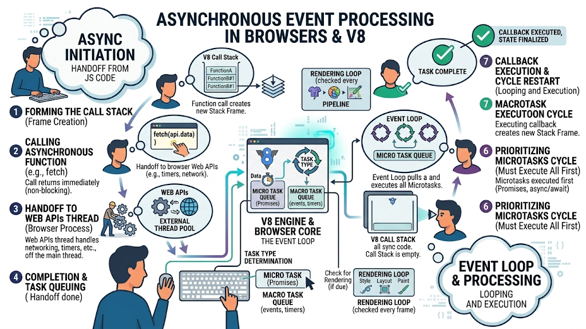
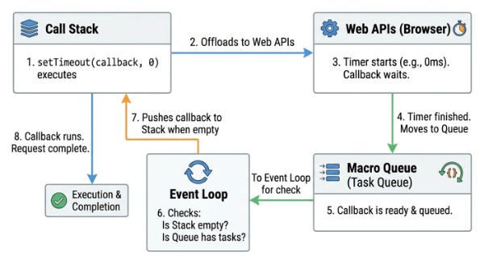
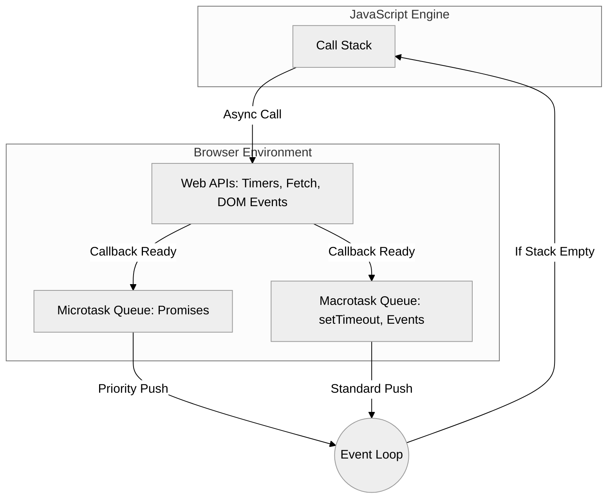

# Asynchronous Browser Events

To understand how React manages state and triggers updates, we must first peel back the layers of the environment where React lives: the web browser. While we often write JavaScript as if it were a continuous stream of logic, the reality is a sophisticated orchestration of timing, prioritization, and communication between the JavaScript engine and the browser’s internal systems. 

At the heart of this complexity is a fundamental paradox: JavaScript is single-threaded, meaning it can only execute one piece of code at a time. Yet, modern web applications handle thousands of concurrent tasks—tracking mouse movements, fetching data from servers, and running complex animations—all without freezing the user interface. This seamless experience is made possible by the Asynchronous Event Loop, a mechanism that allows the browser to offload heavy lifting and return to the main execution thread only when necessary.



### The Execution Stack and the V8 Engine

When you run a JavaScript function, it enters the **Call Stack**. The stack follows a Last-In, First-Out (LIFO) principle. Every time a function is called, a "stack frame" is created containing the function's arguments and local variables. When the function returns, its frame is popped off the stack.

If you call a function that performs a massive mathematical calculation, the stack remains occupied, and the browser becomes "blocked." Because the UI rendering and user interactions also require the main thread, a blocked stack results in a frozen screen. To prevent this, the browser delegates time-consuming tasks to specialized components outside the JavaScript engine.

### Web APIs: The Browser's External Workforce

The V8 engine (used in Chrome and Edge) does not actually contain timers like `setTimeout` or the ability to make network requests like `fetch`. These are **Web APIs** provided by the browser environment. 

When you call `setTimeout(() => { ... }, 1000)`, V8 pushes the call to the stack, triggers the browser's internal timer, and then immediately pops the call off the stack. The JavaScript engine is now free to do other things while the browser’s timer counts down in the background. Once the timer expires, the browser doesn't just shove the callback function back onto the stack; it places it into a queue, waiting for its turn to be processed.



### The Event Loop and Task Management

The Event Loop is a constant process that monitors two things: the Call Stack and the Task Queues. Its job is simple: if the Call Stack is empty, it takes the first task from the queue and pushes it onto the stack for execution.

However, not all tasks are created equal. The browser distinguishes between **Macrotasks** and **Microtasks**, and understanding this distinction is vital for mastering React’s internal behavior.

#### Macrotasks (Task Queue)
Macrotasks represent discrete pieces of work that the browser handles. Common examples include:
*   Parsing HTML
*   Executing a script block
*   `setTimeout` and `setInterval` callbacks
*   User interaction events (clicks, scrolls, keypresses)
*   I/O operations

#### Microtasks (Microtask Queue)
Microtasks are smaller tasks that should be executed immediately after the currently executing script and before the browser yields control back to the event loop. Common examples include:
*   Promise callbacks (`.then`, `.catch`, `.finally`)
*   `queueMicrotask`
*   MutationObserver

The critical rule is this: **The Microtask Queue is always emptied before the next Macrotask begins.** If a microtask schedules another microtask, that new task is also processed before the event loop moves on. This is why an infinite loop of Promises can freeze a browser just as effectively as a `while(true)` loop.

### Visualizing the Workflow

The following diagram illustrates how the engine, APIs, and queues interact to keep the application responsive.



### The Rendering Loop

Between tasks, the browser may decide to perform a "render" step. This includes recalculating styles (Recalculate Style), determining the geometry of elements (Layout), and drawing the pixels (Paint). 

The browser typically aims for a refresh rate of 60 frames per second, meaning a render occurs roughly every 16.7 milliseconds. If a macrotask takes 30ms to run, the browser cannot render during that time, leading to "jank" or stuttering. Because Microtasks are processed immediately after the stack clears, they can also delay the rendering step if they are too numerous or complex.

### Practical Example: Execution Order

Consider the following code snippet. Can you predict the order of the console logs?

```javascript
console.log("1: Script Start");

setTimeout(() => {
  console.log("2: Timeout (Macrotask)");
}, 0);

Promise.resolve().then(() => {
  console.log("3: Promise (Microtask)");
});

console.log("4: Script End");
```

**The result will be:**
1.  `1: Script Start` (Synchronous)
2.  `4: Script End` (Synchronous)
3.  `3: Promise (Microtask)` (Processed immediately after the current script)
4.  `2: Timeout (Macrotask)` (Processed in the next turn of the event loop)

Even though the `setTimeout` has a delay of `0`, the Promise takes priority because it is a microtask.

### Common Challenges and Solutions

**Challenge: Blocking the Main Thread**
When developers perform heavy data processing (like filtering 100,000 records) directly in an event handler, the UI becomes unresponsive.
*   *Solution:* Break the work into smaller chunks using `setTimeout` to yield back to the browser, or use a **Web Worker** to run the logic on a completely separate thread.

**Challenge: Race Conditions in Asynchronous Events**
When multiple asynchronous requests are triggered (e.g., searching as a user types), a slower, older request might return after a newer one, overwriting the state with "stale" data.
*   *Solution:* Use "cleanup" logic or cancellation tokens (like `AbortController`) to ignore the results of outdated requests.

**Challenge: Microtask Starvation**
Repeatedly queuing microtasks can prevent the Macrotask queue from ever running, effectively blocking user input and rendering.
*   *Solution:* Be mindful of recursive Promise chains and ensure that complex logic is occasionally deferred to a macrotask to allow the browser to breathe.

### Summary

The browser’s ability to handle asynchronous events is a carefully balanced act. The **Call Stack** handles immediate execution, while **Web APIs** manage long-running tasks in the background. The **Event Loop** acts as a traffic controller, prioritizing the **Microtask Queue** (Promises) over the **Macrotask Queue** (Timers, UI Events). Finally, the **Rendering Loop** ensures the visual interface stays updated, provided the JavaScript thread isn't held hostage by long-running code. 

For a React developer, these concepts are foundational. React’s "Fiber" architecture and its scheduling of state updates are essentially sophisticated ways of working within these browser constraints to ensure that high-priority tasks (like typing) are never blocked by lower-priority tasks (like rendering a large list).


```masteryls
{"id":"fe720d1a-164c-48c0-a59a-eaedb5f72d28", "title":"Purpose of Macro and Microtask Queues", "type":"multiple-choice"}
In the context of the browser's event loop and V8 engine, why does the architecture distinguish between a macrotask (Task) queue and a microtask queue?

- [ ] To allow the browser to move long-running JavaScript execution to a background thread while the microtask queue handles UI updates on the main thread.
- [x] To ensure high-priority actions, such as Promise resolutions, are executed immediately after the current execution context finishes but before the browser performs rendering or picks up the next external event.
- [ ] To prevent the call stack from overflowing by automatically moving recursive function calls into the microtask queue instead of the stack frame.
- [ ] To ensure that Web API callbacks, such as `setTimeout` or `setInterval`, are given higher execution priority than internal state changes to maintain a consistent frame rate.
```


***

**Deep Dive Resources:**
*   [MDN Web Docs: Concurrency model and the event loop](https://developer.mozilla.org/en-US/docs/Web/JavaScript/Event_loop)
*   [Jake Archibald: In The Loop (JSConf Video)](https://www.youtube.com/watch?v=8aGhZQkoFbQ)
*   [V8 Engine Documentation](https://v8.dev/docs)