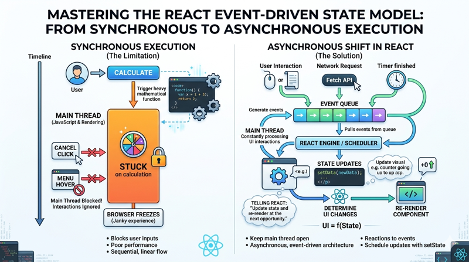
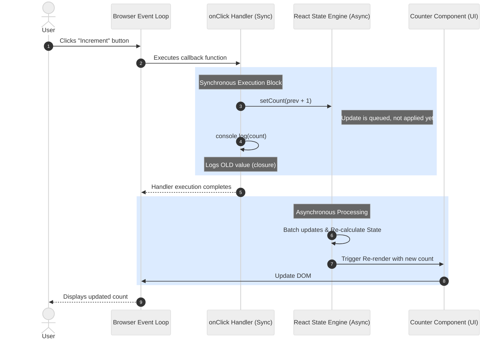

# Introduction to Asynchronous Events in React

In the world of modern web development, responsiveness is the hallmark of a high-quality user experience. When a user clicks a button, types into a search bar, or scrolls through a feed, they expect the interface to react instantly. However, behind the scenes, the computer is often performing complex tasks like fetching data from a server, calculating layout changes, or processing large datasets. If these tasks were handled synchronously, the entire browser window would freeze until the operation finished, leading to a frustrating "janky" experience.

React addresses this challenge by leveraging an asynchronous, event-driven architecture. To master React, one must move beyond thinking of code as a linear sequence of instructions and begin viewing it as a series of reactions to events. This shift in perspective is the foundation of the React Event-Driven State Model.




## The Synchronous Execution Model

To understand the power of asynchronous events, we must first look at the limitations of synchronous execution. In a purely synchronous environment, code is executed line by line. Each operation must complete before the next one begins. 

Consider a scenario where a user clicks a "Calculate" button that triggers a heavy mathematical function. In a synchronous world, the main thread—the part of the browser responsible for both running JavaScript and painting the screen—would be entirely occupied by that calculation. If the user tried to click "Cancel" or hover over a menu during those few seconds, the browser would ignore them because it is still "stuck" on the calculation line.

## The Asynchronous Shift in React

React operates on the principle that the user interface is a function of state. However, the transitions between states are almost always triggered by events. These events—ranging from a mouse click to a timer finishing or a network request returning—happen at unpredictable times.

Asynchronous programming allows React to initiate a task and then "step aside," keeping the main thread open to listen for other user interactions. When the task completes or the user interacts with the page, an event is placed in a queue. React’s internal engine eventually picks up this event, updates the state, and determines what parts of the UI need to change.

This is why we often say that React doesn't just "render" a page; it "schedules" updates. When you call a state updater like `setCount`, you aren't changing a variable in real-time. Instead, you are telling React: "At the next available opportunity, please update this state and re-render the component."

## Practical Example: The "State is a Snapshot" Concept

One of the most common points of confusion for developers new to React's asynchronous nature is why state doesn't update immediately after calling a setter function. 

Consider the following code snippet:

```javascript
function Counter() {
  const [count, setCount] = React.useState(0);

  const handleClick = () => {
    setCount(count + 1);
    console.log("Current count in console:", count);
  };

  return (
    <button onClick={handleClick}>
      Count is: {count}
    </button>
  );
}
```

If you click the button, the console will log `0`, even though the UI will eventually update to display `1`. This happens because `handleClick` is an event handler that sees a "snapshot" of the state from the moment the render occurred. The `setCount` call is an asynchronous request to change the state for the *next* render. This prevents the UI from being in an inconsistent state halfway through a function's execution.




#### Key Concepts Demonstrated:

1.  **Synchronous Execution (Steps 2-5):** The `onClick` function runs to completion immediately upon the user's action. During this time, the JavaScript engine is occupied and cannot process other UI tasks.
2.  **Asynchronous State Update (Step 4):** Calling `setCount` does not change the variable in the current scope. Instead, it signals to React that an update is needed.
3.  **Event-Driven Trigger:** The entire cycle is initiated by a DOM event, demonstrating the event-driven nature of modern web interfaces.
4.  **The Render Phase (Steps 7-9):** React waits until the synchronous code has finished (the "stack" is empty) before processing the state queue and updating the Virtual DOM to reflect the change.


## The Event Loop and React’s Reconciliation

React’s event model is built on top of the standard JavaScript Event Loop. The browser continuously checks if there are tasks in the queue (like click events or fetch responses). When a click occurs, the browser executes the associated JavaScript. 

React wraps these native browser events in its own system called **SyntheticEvents**. This ensures that events behave identically across different browsers and allows React to perform optimizations like event pooling and automatic batching. In recent versions of React, multiple state updates triggered within the same asynchronous event (like a `fetch` callback) are batched together into a single re-render, significantly improving performance.


## Common Challenges and Solutions

Transitioning to an asynchronous mindset introduces specific hurdles that developers must learn to navigate. While synchronous execution processes code in a linear, blocking sequence, React leverages an asynchronous, event-driven model to maintain a responsive user interface. 

This paradigm shift requires developers to move away from the expectation that state updates are immediate or that operations will always resolve in the exact order they were triggered. Navigating this transition often reveals friction points where the timing of the JavaScript event loop intersects with React’s rendering lifecycle. The following examples explore common challenges—such as stale closures, race conditions, and managing concurrent side effects—offering solutions to ensure predictable behavior in a non-blocking environment.


### Problem 1: The Race Condition Problem in React

A **race condition** occurs in asynchronous programming when the outcome of a process depends on the uncontrollable timing or order of events. In React, this most commonly happens during data fetching within the `useEffect` hook.

#### Synchronous vs. Asynchronous Execution
*   **Synchronous Execution:** Each operation waits for the previous one to complete. If you request data for User A and then User B, the UI would remain frozen until User A is finished, then freeze again for User B.
*   **Asynchronous Execution:** React initiates a request and continues executing other code (like rendering the UI). The response is handled whenever it arrives. If multiple requests are "in flight" at the same time, there is no guarantee they will resolve in the order they were started.


#### Code Example: The "Stale Data" Bug

In this example, a user switches between different profiles. If the network response for an earlier request arrives *after* the response for the most recent request, the UI will display the wrong data.

```javascript
import React, { useState, useEffect } from 'react';

function UserProfile({ userId }) {
  const [user, setUser] = useState(null);

  useEffect(() => {
    // Reset user state while loading
    setUser(null);

    // Asynchronous event: Fetching data from an API
    fetch(`https://api.example.com/users/${userId}`)
      .then((response) => response.json())
      .then((data) => {
        // RACE CONDITION:
        // If the user clicks 'User 1' then quickly clicks 'User 2',
        // two fetch requests are triggered. 
        // If 'User 1' takes 5 seconds and 'User 2' takes 1 second:
        // 1. User 2's data arrives and setUser(User2) is called.
        // 2. User 1's data arrives later and setUser(User1) is called.
        // RESULT: The UI shows User 1 even though the current userId prop is 2.
        setUser(data);
      });
  }, [userId]);

  if (!user) return <p>Loading...</p>;

  return (
    <div>
      <h1>User ID: {userId}</h1>
      <p>Name: {user.name}</p>
    </div>
  );
}
```

#### The Execution Timeline

1.  **T = 0ms:** Component receives `userId = 1`. `useEffect` triggers **Fetch A**.
2.  **T = 100ms:** User clicks a button; component receives `userId = 2`. `useEffect` triggers **Fetch B**.
3.  **T = 500ms:** **Fetch B** completes. `setUser` updates the state with User 2's data. The screen shows **User 2**.
4.  **T = 1000ms:** **Fetch A** (the slower request) finally completes. `setUser` updates the state with User 1's data.
5.  **Final State:** The component prop is `userId = 2`, but the screen displays **User 1**.

#### The Solution: Cleanup Functions
To prevent race conditions, you must ignore the result of an asynchronous operation if the component has re-rendered with new props or unmounted. This is achieved using a "boolean flag" inside the `useEffect` cleanup function.

```javascript
useEffect(() => {
  let isCurrent = true; // Flag to track the relevance of this specific effect execution

  fetch(`https://api.example.com/users/${userId}`)
    .then((res) => res.json())
    .then((data) => {
      if (isCurrent) {
        setUser(data); // Only update state if this is still the most recent request
      }
    });

  return () => {
    // This cleanup function runs before the effect re-runs or the component unmounts
    isCurrent = false; 
  };
}, [userId]);
```

By using this pattern, when **Fetch A** finally resolves at T = 1000ms, the `isCurrent` flag for that specific closure will be `false` (set by the cleanup phase when `userId` changed to 2), and the stale data will be discarded.


### Problem 2: Understanding Stale Closures in React

A **stale closure** occurs when a function "captures" a variable from a specific render cycle and continues to reference that old value, even after the component has re-rendered with new state. This is a common challenge in asynchronous event-driven programming within React.

#### The Synchronous vs. Asynchronous Conflict

In React, every render is a snapshot of the component at a specific point in time. 
*   **Synchronous execution:** When you update state, React schedules a new render.
*   **Asynchronous execution:** Functions like `setTimeout`, `setInterval`, or Promise callbacks are scheduled to run later. If these callbacks reference state variables, they reference the variable from the render cycle in which they were **created**, not the cycle in which they are **executed**.

#### The Example: The Delayed Alert

In this example, we have a counter. We trigger an alert that will display the count after a 3-second delay.

```jsx
import React, { useState } from 'react';

function StaleCounter() {
  const [count, setCount] = useState(0);

  const handleAlertClick = () => {
    // This function captures the value of 'count' 
    // at the exact moment the user clicks the button.
    setTimeout(() => {
      alert(`The count captured in this closure is: ${count}`);
    }, 3000);
  };

  return (
    <div>
      <p>Current Count: {count}</p>
      <button onClick={() => setCount(count + 1)}>
        Increment
      </button>
      <button onClick={handleAlertClick}>
        Show Alert (3s Delay)
      </button>
    </div>
  );
}

export default StaleCounter;
```

#### How to Trigger the Stale Closure:
1.  Click the **Increment** button a few times (e.g., set `count` to 3).
2.  Click the **Show Alert** button. The `handleAlertClick` function is now scheduled.
3.  **Immediately** click the **Increment** button three more times (the UI now shows `6`).
4.  Wait for the alert to appear.

**The Result:** The alert will display **3**, even though the UI currently displays **6**.

#### Why this happens:
1.  When `handleAlertClick` was called, it created a closure over the `count` variable from that specific render (where `count` was 3).
2.  Even though the component re-rendered and created new versions of the `count` variable, the `setTimeout` callback is still holding onto the reference from the old render.
3.  Because the event is asynchronous, the execution of the alert happens in a future where the data it "remembered" is now stale.

#### The Solution: Using `useRef`

To access the "latest" value in an asynchronous callback without being trapped by a closure, we use the `useRef` hook. References (`refs`) persist across renders and do not create new closures when their `.current` property changes.

```jsx
import React, { useState, useRef, useEffect } from 'react';

function FixedCounter() {
  const [count, setCount] = useState(0);
  const countRef = useRef(count);

  // Keep the ref in sync with the latest state
  useEffect(() => {
    countRef.current = count;
  }, [count]);

  const handleAlertClick = () => {
    setTimeout(() => {
      // By accessing the ref, we get the most up-to-date value
      // regardless of when the closure was created.
      alert(`The latest count is: ${countRef.current}`);
    }, 3000);
  };

  return (
    <div>
      <p>Current Count: {count}</p>
      <button onClick={() => setCount(count + 1)}>Increment</button>
      <button onClick={handleAlertClick}>Show Alert (3s Delay)</button>
    </div>
  );
}
```

In this fixed version, even if you increment the state after clicking "Show Alert," the asynchronous callback will successfully retrieve the most recent value from `countRef.current`.


### Problem 3: The Infinite Loop Problem in React

In React, an infinite loop typically occurs when a state update triggers a re-render, which then immediately triggers the same state update again. This happens because React's rendering process is **synchronous**, while state updates are **asynchronous** and scheduled.

```jsx
import React, { useState, useEffect } from 'react';

function InfiniteLoopComponent() {
  const [count, setCount] = useState(0);

  // This effect runs after every render
  useEffect(() => {
    // 1. React finishes rendering the UI.
    // 2. This effect is triggered.
    // 3. setCount schedules an asynchronous update.
    // 4. React detects a state change and triggers a new synchronous render.
    // 5. The cycle repeats indefinitely.
    setCount(count + 1);
  }); 

  return (
    <div>
      <h1>Count: {count}</h1>
    </div>
  );
}
```

#### Why This Happens

1.  **Synchronous Rendering:** When `InfiniteLoopComponent` executes, React runs the function body synchronously to determine what the UI should look like.
2.  **Asynchronous State Updates:** The `setCount` function doesn't change the value of `count` immediately. Instead, it signals to React that the state needs to change and that the component needs to be re-rendered with the new value.
3.  **The Event Loop Cycle:** 
    *   The component renders.
    *   The `useEffect` hook (an event-driven side effect) fires.
    *   Inside the effect, a state update is requested.
    *   React reacts to the state change by re-executing the component function.
    *   Because the `useEffect` has no dependency array `[]`, it runs again after this new render, creating a loop.

#### Synchronous Execution Trap

Another common way to trigger an infinite loop is by calling a state setter directly in the body of the function (the "render phase"):

```jsx
function DirectUpdateLoop() {
  const [value, setValue] = useState(false);

  // ERROR: This is called synchronously during the render phase.
  // React will throw an error: "Too many re-renders."
  setValue(true); 

  return <div>{value.toString()}</div>;
}
```

In this case, React detects that you are trying to change the state while the component is still in the middle of calculating its output. To prevent the browser from freezing due to the synchronous nature of the JavaScript execution stack, React will force-quit the process with a "Too many re-renders" error.


#### Infinite loop Solution

Carefully manage dependency arrays in hooks and ensure that event listeners are properly detached when components unmount.

```jsx
import React, { useState, useEffect } from 'react';

function InfiniteLoopComponent() {
  const [count, setCount] = useState(0);

  // Trigger on initial render
  useEffect(() => {
    setCount(count + 1);
  }, []); 

  // Trigger on user event
  const handleClick = () => setCount(count + 1);


  return (
    <div>
      <h1 onClick={handleClick}>Count: {count}</h1>
    </div>
  );
}
```


## Thoughtful Engagement

As you progress through this module, consider how the asynchronous nature of React changes the way you design user interfaces. Ask yourself:
*   How does the user experience change when we prioritize responsiveness over immediate data consistency?
*   Why might React choose to delay a state update rather than performing it instantly?
*   In what scenarios could "synchronous" behavior actually be preferable, and how does React accommodate those rare cases?

## Summary

Asynchronous event-driven programming is the engine that allows React to build fluid, interactive applications. By decoupling the trigger (the event) from the result (the state update), React ensures that the main thread remains free to handle user input. Understanding that state updates are scheduled transitions rather than immediate assignments is the first step toward mastering the React Event-Driven State Model.

***

**Further Reading and Resources:**
*   [MDN Web Docs: General Asynchronous Programming Concepts](https://developer.mozilla.org/en-US/docs/Learn/JavaScript/Asynchronous/Concepts)
*   [React Documentation: State as a Snapshot](https://react.dev/learn/state-as-a-snapshot)
*   [The JavaScript Event Loop Explained (Video)](https://www.youtube.com/watch?v=8aGhZQkoFbQ)