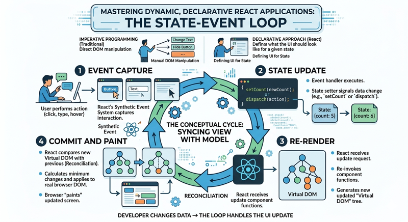

# The State-Event Loop

At the heart of every dynamic React application lies a continuous, rhythmic cycle known as the State-Event Loop. While traditional imperative programming often treats user interface updates as a series of direct commands—telling the browser exactly which element to change and when—React adopts a declarative approach. In this model, the developer defines what the UI should look like for any given state, and the React runtime manages the transition between those states. Understanding the State-Event Loop is essential because it shifts your perspective from "manipulating the DOM" to "managing data flow," which is the fundamental requirement for building scalable, predictable web applications.

## The Conceptual Cycle



The State-Event Loop can be visualized as a four-stage process that repeats every time a user interacts with your application. This cycle ensures that the view (what the user sees) always stays in sync with the model (the underlying data).

1.  **Event Capture:** The user performs an action, such as clicking a button, typing in a text field, or hovering over an element. React’s synthetic event system captures this interaction.
2.  **State Update:** An event handler function is executed. Inside this function, a state setter (like `setCount` or `dispatch`) is called, signaling to React that the data driving the UI has changed.
3.  **Re-render:** React receives the update request and re-invokes your component functions. It generates a new "Virtual DOM" tree representing the updated state of the application.
4.  **Commit and Paint:** React compares the new Virtual DOM with the previous version (a process called reconciliation). It calculates the minimum number of changes needed and applies them to the real browser DOM, which the browser then "paints" onto the screen.

This loop ensures that the developer never has to manually "reach into" the page to change a piece of text. Instead, you simply change the data, and the loop handles the rest.

## The Role of the Event Handler

The event handler acts as the bridge between the physical world of the user and the digital world of the application state. In React, these are passed as props to JSX elements (e.g., `onClick`, `onChange`). 

It is important to remember that event handlers in React have access to the state as it existed at the time the render was generated. This is a concept known as a "closure." When a user clicks a button, the handler doesn't look at the "current" live state of the screen; it executes based on the values it was "closed over" when that specific version of the component was rendered. This leads to a highly predictable flow of information, but it also requires developers to be mindful of how they update state.

## Practical Example: The Interactive Search Filter

Consider a search bar that filters a list of items. In a traditional environment, you might write code that hides or shows HTML list items as the user types. In the React State-Event Loop, we focus on the data.

```javascript
import React, { useState } from 'react';

function SearchComponent({ items }) {
  const [searchTerm, setSearchTerm] = useState('');

  // 1. The Event Handler
  const handleInputChange = (event) => {
    // 2. The State Update
    setSearchTerm(event.target.value);
  };

  // 3. The Re-render logic
  // This logic runs every time searchTerm changes
  const filteredItems = items.filter(item =>
    item.toLowerCase().includes(searchTerm.toLowerCase())
  );

  return (
    <div>
      <input 
        type="text" 
        value={searchTerm} 
        onChange={handleInputChange} 
        placeholder="Search items..."
      />
      <ul>
        {filteredItems.map((item, index) => (
          <li key={index}>{item}</li>
        ))}
      </ul>
    </div>
  );
}
```

In this example, when the user types a single character, the `onChange` event fires. The `handleInputChange` function calls `setSearchTerm`, which triggers the loop. React re-renders the `SearchComponent`, recalculates the `filteredItems` array based on the new `searchTerm`, and updates only the specific list items in the DOM that need to change.

## State Update Batching and Asynchronicity

One of the most common points of confusion in the State-Event Loop is that state updates are not instantaneous. If you call a state setter and immediately try to log that state on the next line, you will see the *old* value.

React batches state updates to improve performance. If an event handler contains three different state updates, React will wait until the handler finishes, then perform a single re-render for all three changes. This prevents the browser from doing unnecessary work and ensures the UI doesn't flicker through intermediate states. This "asynchronous" nature is a design choice that prioritizes responsiveness and efficiency.

## Common Challenges and Solutions

Navigating the State-Event Loop involves overcoming a few architectural hurdles. The following examples describe common challenges and provide possible solutions.

### 1. Accessing State Immediately After an Update

**The Challenge**
React state updates are not synchronous. When a user event triggers a state update function, the local variable holding the state value does not change until the next render. Attempting to use the state variable immediately after calling the setter function results in using the "stale" value from the current render cycle.

```javascript
const [count, setCount] = useState(0);

const handleIncrement = () => {
  setCount(count + 1);
  console.log(count); // Output will be 0, not 1
};
```

**The Solution**
*   **Use local variables:** If you need the new value immediately within the same event handler, calculate it and store it in a constant.
*   **Use `useEffect`:** If you need to perform a side effect based on the updated state, use the `useEffect` hook with the state variable in the dependency array.

    ```javascript
    const handleIncrement = () => {
      const nextCount = count + 1;
      setCount(nextCount);
      performAction(nextCount); // Uses the correct, updated value
    };
    ```

### 2. Stale Closures in Asynchronous Logic

**The Challenge**
Event handlers often trigger asynchronous operations like `setTimeout` or API calls. Because React event handlers are closures that capture the state at the time of the render, an asynchronous callback might reference state values that are several cycles out of date by the time the callback executes.

```javascript
const [count, setCount] = useState(0);

const handleAsyncClick = () => {
  setTimeout(() => {
    // This will always use the 'count' value from when the button was clicked
    alert("Count at time of click: " + count);
  }, 3000);
};
```

**The Solution**
*   **Functional Updates:** When updating state based on a previous value within an async operation, always use the functional update pattern (`setCount(prev => prev + 1)`).
*   **Refs for synchronous access:** If you must read the *absolute latest* value inside an async block without triggering a re-render, use `useRef` to track the state.

### 3. Multiple Updates and Batching

**The Challenge**
A single user event may trigger multiple state updates. Developers often worry that this will cause multiple expensive re-renders. In older versions of React, updates inside promises or timeouts were not batched, leading to performance degradation.

```javascript
const handleClick = () => {
  setCount(c => c + 1);
  setFlag(f => !f);
  // React 18+ batches these into a single re-render
};
```

**The Solution**
*   **Automatic Batching:** In React 18 and later, all updates triggered by user events, promises, and setTimeouts are batched automatically.
*   **Object State:** If multiple pieces of data always change together, consider grouping them into a single state object to ensure they are updated in a single atomic operation.

### 4. Unnecessary Re-renders of Child Components

**The Challenge**
When a user event updates state in a parent component, the entire component tree below it re-renders by default. If the child components are computationally expensive or do not depend on the changed state, this results in wasted resources.

**The Solution**
*   **React.memo:** Wrap child components in `memo` to prevent a re-render unless their props have changed.

    ```jsx
    import React, { useState } from 'react';

    // This component is wrapped in memo. 
    // It will only re-render if its props (title) change.
    const ExpensiveComponent = React.memo(({ title }) => {
      console.log("Child rendered");
      return (
        <h3>{title}</h3>
      );
    });

    export default function App() {
      const [count, setCount] = useState(0);
      const [title, setTitle] = useState("Hello World");

      return (
        <div style={{ padding: '20px' }}>
          <h2>Parent State: {count}</h2>
          
          {/* 
            User Event: Clicking this button updates state.
            Update Cycle: setCount triggers a re-render of the App component.
            Memoization: Because 'title' hasn't changed, ExpensiveComponent skips re-rendering.
          */}
          <button onClick={() => setCount(count + 1)}>
            Increment Counter
          </button>

          {/* 
            User Event: This button changes the prop passed to the child.
            Update Cycle: setTitle triggers a re-render.
            Memoization: React detects the 'title' prop is different and re-renders the child.
          */}
          <button onClick={() => setTitle("Updated Title " + Math.random())}>
            Change Title
          </button>

          <ExpensiveComponent title={title} />
        </div>
      );
    }
    ```

*   **useCallback:** When passing functions as props to memoized children, wrap the functions in `useCallback`. This ensures the function reference remains stable across renders, preventing the child from detecting a "prop change."

    ```javascript
    const memoizedCallback = useCallback(() => {
      doSomething(a, b);
    }, [a, b]); // Only changes if a or b change

    return <ExpensiveChild onClick={memoizedCallback} />;
    ```


### 5. Infinite Render Loops

**The Challenge**
An infinite loop occurs when a state update is triggered directly within the body of a component or inside a `useEffect` that has the updated state as a dependency without a proper exit condition.

```javascript
// Warning: This will cause an infinite loop
useEffect(() => {
  setCount(count + 1);
}, [count]);
```

**The Solution**
*   **Conditional Logic:** Ensure state updates inside `useEffect` are wrapped in conditional checks.
*   **Correct Dependencies:** Audit dependency arrays to ensure you aren't listening to the same value you are modifying, or use the functional update pattern to remove the state variable from the dependency array.

    ```javascript
    useEffect(() => {
      if (count < 10) {
        setCount(prev => prev + 1);
      }
    }, []); // Empty dependency or logic-based dependency
    ```


## Summary

The State-Event Loop is the engine that drives React's interactivity. By moving away from manual DOM manipulation and toward a cycle of **Event → State Update → Re-render → Commit**, React allows developers to build complex interfaces that are easier to debug and maintain. The key to mastering this loop is recognizing that the UI is a function of state, and events are the only mechanism by which that state should change.

For further exploration of how React handles these updates internally, the [React Documentation on State](https://react.dev/learn/state-a-components-memory) and the [MDN guide on the Event Loop](https://developer.mozilla.org/en-US/docs/Web/JavaScript/Event_loop) provide excellent technical deep dives.

As you continue through this module, challenge yourself to think about your components not as static templates, but as living entities that react to a constant stream of events. Ask yourself: "What state represents this change?" and "How does this event trigger the next turn of the loop?"